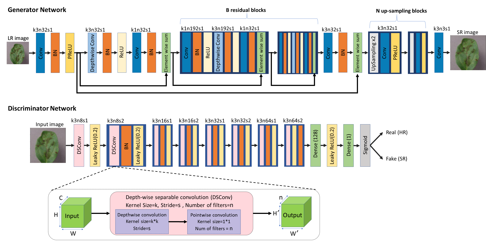
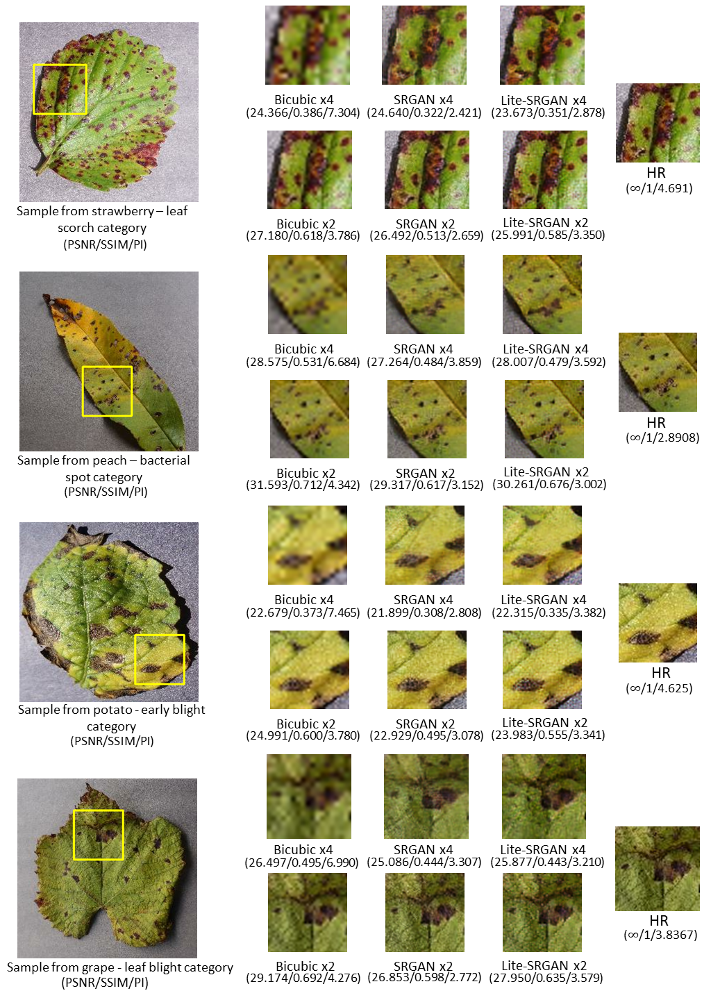
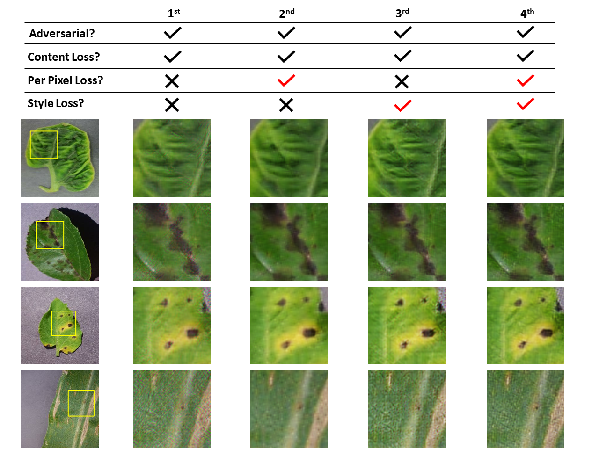
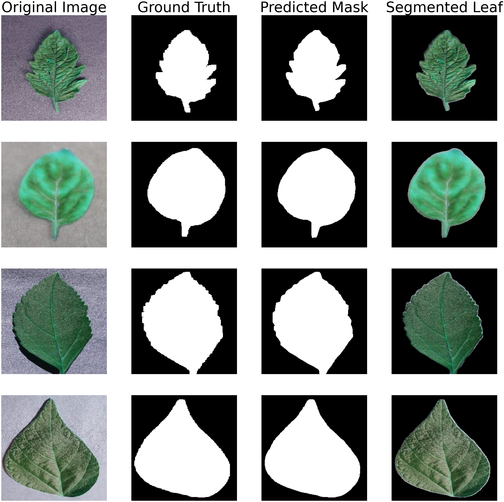
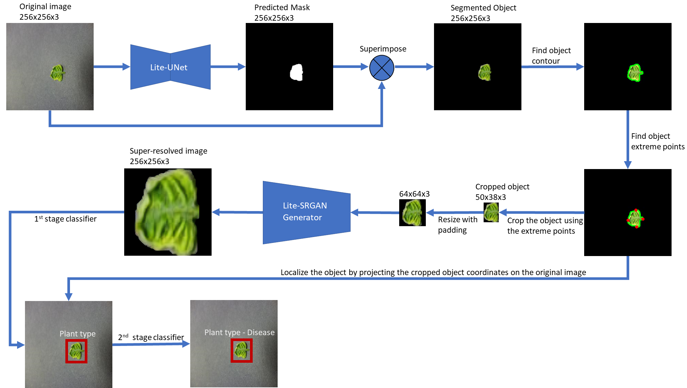

# Lite-SRGAN and Lite-UNet: Towards fast and accurate image super-resolution, segmentation and localization for plant leaf diseases

This repository is the official implementation of the paper [Lite-SRGAN & Lite-UNet](https://ieeexplore.ieee.org/document/10163802).

<hr />

**Abstract:** *Complex deep convolutional networks are usually designed to achieve state-of-the-art results. Such networks require powerful computing resources and can’t work efficiently on resource-constrained devices specially for real-time use. To address these challenges, this paper introduces a full lightweight approach for segmentation, localization, super-resolution and classification tasks. On this basis, we propose two novel lightweight architectures named Lite-UNet and Lite-SRGAN. We validated the effectiveness of our proposed networks on the large publicly available Plant Village dataset. Lite-UNet network is used for performing segmentation and localization tasks, while Lite-SRGAN network is used for performing the super-resolution task. The proposed Lite-UNet outperforms U-Net with a slight gain of 0.06% and 0.12% for dice coefficient and IoU respectively while achieving a significant reduction of 15.9x, 25x and 6.6x in terms of parameters, FLOPs and inference time respectively. In addition, the proposed LiteSRGAN achieves comparable qualitative and quantitative results compared to SRGAN with a significant reduction of 7.5x, 7.8x and 2.7x in terms of parameters, FLOPs and inference time respectively when upsampling the low-resolution images from 64x64 to 256x256 (4x upscaling). Similarly, it achieves a reduction of 7.1x, 11.2x and 1.9x when upsampling from 128x128 to 256x256 (2x upscaling).*

<hr />


# Lite-SRGAN
<p float="left">
  
  
  </p>


## Lite-SRGAN architecture



## Qualitative Results
PSNR and SSIM (evaluated on the Y channel of the YCbCr color space) and the perceptual index (PI) used in the PIRM-SR challenge are provided.
<p align="center">
  
</p>

## Abliation Study (Effect of Loss Functions)
Visual comparison of combining different loss functions together, The red sign indicates the added loss function in each experiment.

<p align="center">
  
</p>

## 🕺 Training on your own dataset

```
python main.py --images_dir "/path/to/images/directory" \
--img_width 256 --img_height 256 --upsampling_blocks 2 \
--batch_size 8 --lr 1e-4 --pretraining_epochs 100 --epochs 100
```

* ``` --upsampling_blocks ``` refers to the number of upsampling blocks for upsampling the low resolution image
  i.e (1 upsampling block = 2x upscaling , 2 upsampling blocks = 4x upscaling , 3 upsampling blocks = 8x upscaling, etc.')
  
* ``` --pretraining_epochs ``` refers to the number of epochs where the generator is pre-trained with pixel loss (L1) only to avoid getting stuck in local minima in the early beginning of the training process , Note: number of pre_training steps/iterations = (pretraining_epochs x number of training samples) / batch_size

* ``` epochs ``` if you want to use the same number of training update steps/iterations as stated in the paper, you can get the number of iterations using this equation, number of training steps/iterations = (epochs x number of training samples) / batch_size
 

# Lite-UNet
## Lite-UNet architecture

<p align="center">
  
</p>

## Qualitative Results

<p align="center">
  
</p>

## 🏃 Training on your own dataset

```
python main.py --train_data "/path/to/training/images" \
--train_annot "/path/to/training/annotations" \
--val_data "/path/to/validation/images" \
--val_annot "/path/to/validation/annotations" \
--img_width 224 --img_height 256 --batch_size 32 --lr 0.0001\
--epochs 20 --output_dir "/path/to/save/Lite-UNet/model"
```

# Full Methodology

The full methodology depicts how the two proposed architectures can be used together to form a whole superior lightweight methodology capable of performing segmentation, localization, super-resolution and enhancing classification.  



<hr />

## 📧 Contact
if you have any question, please email `hosamsherif2000@gmail.com` or `hossamsherif@cis.asu.edu.eg`

## License
This project is released under the MIT license. Please see the [LICENSE](LICENSE.md) file for more information.

## Citation
Please consider citing our paper if you find it useful in your research
```
@article{el2023lite,
  title={Lite-SRGAN and Lite-UNet: Towards Fast and Accurate Image Super-Resolution, Segmentation, and Localization for Plant Leaf Diseases},
  author={El-Assiouti, Hosam S and El-Saadawy, Hadeer and Al-Berry, Maryam N and Tolba, Mohamed F},
  journal={IEEE Access},
  year={2023},
  publisher={IEEE}
}
```
